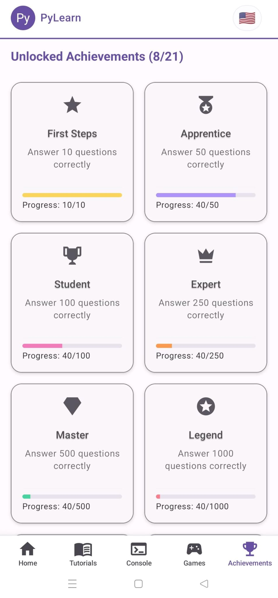

# 🐍 PyLearn

### **Aprende Python desde tu móvil** | **Learn Python on the go**

[🇪🇸 Español](#español) | [🇬🇧 English](#english)

---

## 🇪🇸 Español

### 📱 ¿Qué es PyLearn?

**PyLearn** es una aplicación móvil educativa diseñada para que aprendas Python de forma **interactiva, divertida y práctica** directamente desde tu smartphone. Con un enfoque en la gamificación y el aprendizaje offline, PyLearn te acompaña en tu viaje de programación estés donde estés.

### ✨ Características Principales

- **📚 Lecciones Interactivas**: Tutoriales paso a paso diseñados específicamente para móviles
- **🎯 Quizzes por Niveles**: Pon a prueba tus conocimientos con tests adaptados a tu experiencia
- **📇 Flashcards y Cheatsheets**: Memoriza sintaxis y conceptos clave de Python
- **🎮 Gamificación**: Sistema de rachas diarias, logros y desafíos
- **🏆 Sistema de Logros**: Desbloquea premios mientras progresas
- **📴 Modo Offline**: Funciona sin conexión a internet (excepto para anuncios y ejecución de código)
- **💾 Almacenamiento Local**: Todo tu progreso se guarda en tu dispositivo
- **🎨 Interfaz Moderna**: Diseño intuitivo y atractivo optimizado para móviles

### 📸 Capturas de Pantalla

| Inicio | Lecciones | Flashcards |
|--------|-----------|------------|
|  |  |  |

| Juegos | Logros |
|--------|--------|
|  |  |

### 📥 Instalación

#### Descargar la App

1. Ve a la [página de releases](https://github.com/OxNihil/PyLearn/releases)
2. Descarga el archivo APK más reciente
3. Instala en tu dispositivo Android
4. ¡Comienza a aprender!

> **Nota**: También puedes encontrar PyLearn en tiendas de aplicaciones (próximamente)

### 🚀 Cómo Empezar

1. **Abre la app** y selecciona tu nivel (principiante, intermedio, avanzado)
2. **Completa el tutorial** inicial para familiarizarte con la interfaz
3. **Elige tu camino de aprendizaje**: 
   - Lecciones estructuradas
   - Quizzes rápidos
   - Flashcards para repasar
   - Retos de código
4. **Mantén tu racha diaria** y desbloquea logros
5. **Practica regularmente** y observa tu progreso

### 🎯 ¿Para Quién es PyLearn?

- ✅ **Principiantes** que quieren aprender Python desde cero
- ✅ **Estudiantes** que necesitan repasar conceptos de programación
- ✅ **Desarrolladores** que quieren practicar en sus tiempos libres
- ✅ **Profesionales** que buscan refrescar conocimientos de Python

### 🛡️ Privacidad y Seguridad

PyLearn respeta tu privacidad:
- ❌ No recopilamos datos personales
- ✅ Todo el progreso se almacena localmente
- ✅ No se sincronizan datos con servidores externos

📄 Lee nuestra [Política de Privacidad completa](./PRIVACY.md)

### 📞 Contacto y Soporte

¿Tienes preguntas, sugerencias o encontraste un bug?

- 📧 Email: [lacriptadelhacker@gmail.com](mailto:lacriptadelhacker@gmail.com)
- 🐛 [Reportar un problema](https://github.com/OxNihil/PyLearn/issues)
- 💡 [Sugerir una característica](https://github.com/OxNihil/PyLearn/issues/new)

---

## 🇬🇧 English

### 📱 What is PyLearn?

**PyLearn** is an educational mobile app designed to help you learn Python in an **interactive, fun, and practical** way directly from your smartphone. With a focus on gamification and offline learning, PyLearn accompanies you on your programming journey wherever you are.

### ✨ Key Features

- **📚 Interactive Lessons**: Step-by-step tutorials designed specifically for mobile
- **🎯 Level-Based Quizzes**: Test your knowledge with quizzes adapted to your experience
- **📇 Flashcards & Cheatsheets**: Memorize Python syntax and key concepts
- **🎮 Gamification**: Daily streak system, achievements and challenges
- **🏆 Achievement System**: Unlock rewards as you progress
- **📴 Offline Mode**: Works without internet connection (except for ads and code execution)
- **💾 Local Storage**: All your progress is saved on your device
- **🎨 Modern Interface**: Intuitive and attractive design optimized for mobile

### 📸 Screenshots

| Home | Lessons | Flashcards |
|------|---------|------------|
|  |  |  |

| Games | Achievements |
|-------|--------------|
|  |  |

### 📥 Installation

#### Download the App

1. Go to the [releases page](https://github.com/OxNihil/PyLearn/releases)
2. Download the latest APK file
3. Install on your Android device
4. Start learning!

> **Note**: You can also find PyLearn in app stores (coming soon)

### 🚀 Getting Started

1. **Open the app** and select your level (beginner, intermediate, advanced)
2. **Complete the initial tutorial** to familiarize yourself with the interface
3. **Choose your learning path**: 
   - Structured lessons
   - Quick quizzes
   - Flashcards for review
   - Code challenges
4. **Maintain your daily streak** and unlock achievements
5. **Practice regularly** and watch your progress

### 🎯 Who is PyLearn For?

- ✅ **Beginners** who want to learn Python from scratch
- ✅ **Students** who need to review programming concepts
- ✅ **Developers** who want to practice in their free time
- ✅ **Professionals** looking to refresh their Python knowledge

### 🛡️ Privacy and Security

PyLearn respects your privacy:
- ❌ We don't collect personal data
- ✅ All progress is stored locally
- ✅ No data is synced with external servers
- ✅ Open source and transparent

📄 Read our [complete Privacy Policy](./PRIVACY.md)

### 📞 Contact and Support

Have questions, suggestions, or found a bug?

- 📧 Email: [lacriptadelhacker@gmail.com](mailto:lacriptadelhacker@gmail.com)
- 🐛 [Report an issue](https://github.com/OxNihil/PyLearn/issues)
- 💡 [Suggest a feature](https://github.com/OxNihil/PyLearn/issues/new)

---

### 🌟 Si PyLearn te ha ayudado, dale una estrella ⭐

### 🌟 If PyLearn has helped you, give it a star ⭐

**Made with ❤️ for the developer community**

**Hecho con ❤️ para la comunidad de desarrolladores**

[⬆ Volver arriba](#-pylearn)

